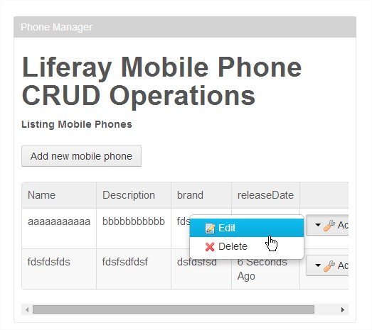
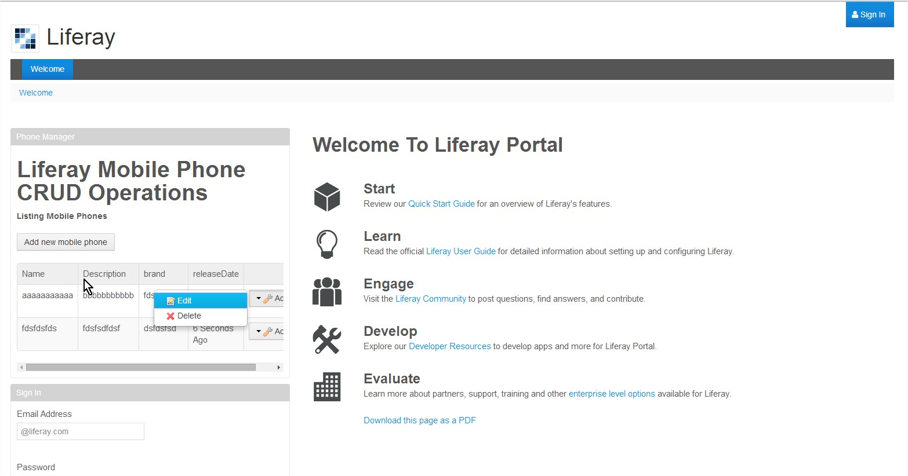

LiferayCRUDPortlet
==================

Sample Portlet application - CRUD Operations.

To build this sample, I used the following tools:

- Eclipse Helios Java EE IDE and some plugins (ex: Sysdeo, EGit)
- Java 1.6.0.32 (JDK 6)
- Tomcat 7.0.42
- Liferay 6.2 Community Edition
- Liferay MVC Framework
- Liferay Service Builder (Code and Infra structure generation)
- Liferay Plugins SDK (portlet)
- Ant (build-service, deploy)
- MySQL 5 Database
- SQLYog Community Edition

<b>This project contains 2 main folders:</b>

- <b> application:</b> Here is the entire application (I´ve uploaded the entire Eclipse project, except for the ".settings" folder), including source code, configuration files, message properties file (Language.properties), ant scripts, database scripts and everything else

- <b> distribution:</b> in this folder you have a .war file of the portlet ready to be deployed in LIferay 6.2. This war file was generated with ant, using the command ant deploy  

